# Fetal Health Risk Detection using Machine Learning with Flask Web App -- Abraham Obianke 

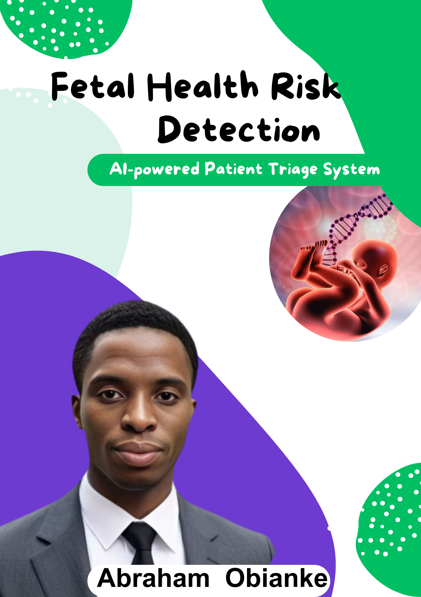

## Introduction 
What is fetal health risk?
Fetal health risk refers to any condition or factor that could potentially harm a developing fetus during pregnancy. These risks can lead to complications such as birth defects, developmental delays, preterm birth, or even miscarriage.  

What can lead to fetal health risk? fetal health problems can be caused by maternal age, lifestyle choices, pre-existing medical conditions, pregnancy complications and structural problems.

*Source(https://www.healthline.com/health/pregnancy/risk-factors)*

## Patient Problem
### Problem Context
According to the UNICEF, the neonatal period is the most vulnerable time for a child. Globally, 2.3 million children died in the first month of life in 2022 – approximately 6,300 neonatal deaths every day.

*Source: (https://data.unicef.org/topic/child-survival/neonatal-mortality/)*

## Objective(s)
- My main aim in this project is to use machine learning to detect fetal health risks which in turn can prevent fetal and maternal mortality. I intend to use classification algorithms to achieve the lowest error in prediction.

## Dataset Information
The dataset was sourced from the University of California Irvine dataset archive consisting of over 2126 Cardiotogram (CTGs) measurements of fetal heart rate (FHR) and uterine contraction (UC) features classified by expert obstetricians.

    
*Data Source:*(https://archive.ics.uci.edu/dataset/193/cardiotocography)

## Mapping Patient Problem to ML Problem

### Type of Machine Learning Problem
+ It is a binary classification problem, where given the above set of features, I need to classify and predict fetal health risks.

## Data Analysis Workflow
- Data Collection
- Importing Data
- Data Cleaning
  - Handling Missing Data
  - Outlier Detection and Removal
- Data Transformation
- Exploring Data using Descriptive Statistics
  - Understanding Data using
    - Univariate Analysis
    - Bivariate Analysis
    - Multivariate Analysis
- Understanding Data using Visualizations
    - Univariate
      - Histograms
      - Density Plot
    - Bivariate
      - Boxplot
    - Multivariate
      - Correlation Matrix

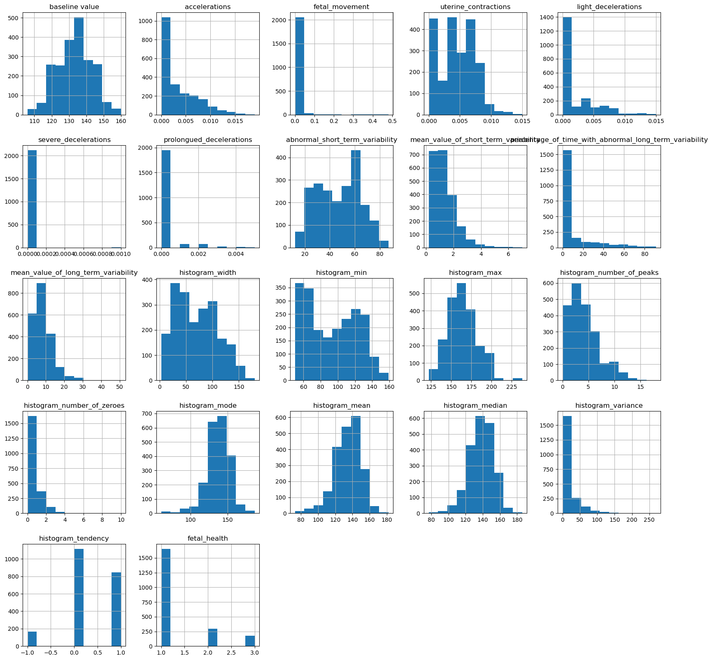
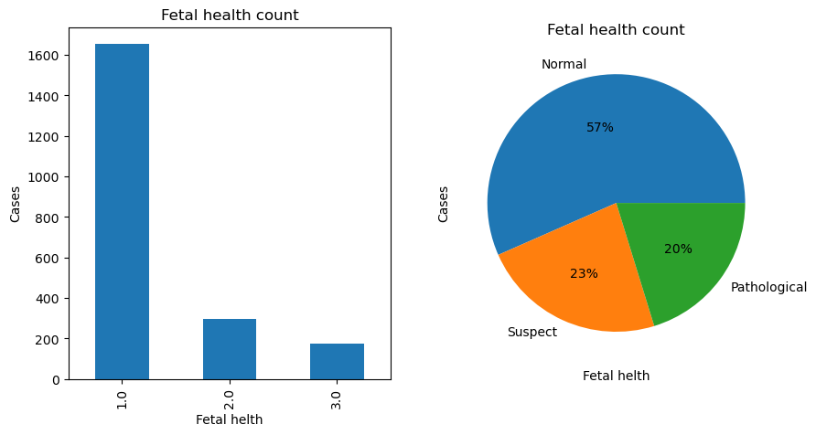
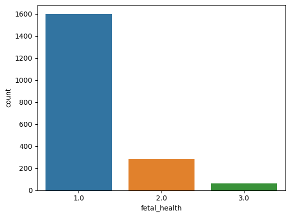
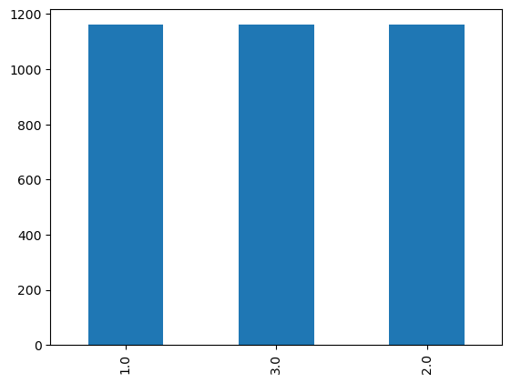
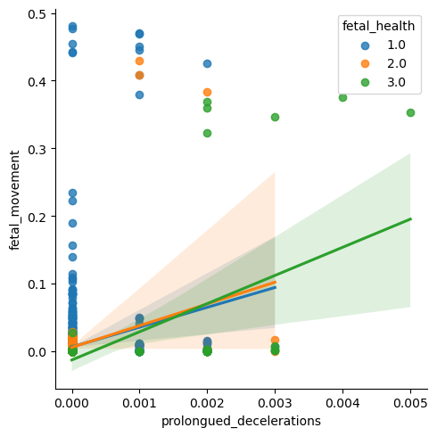

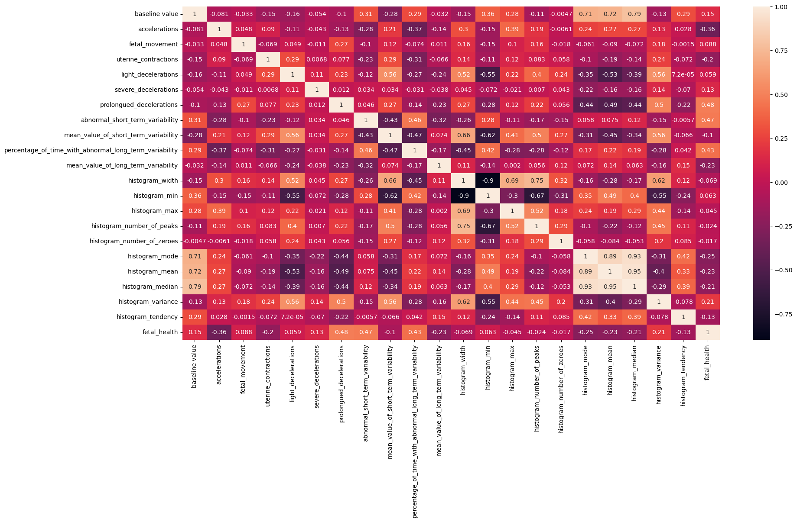
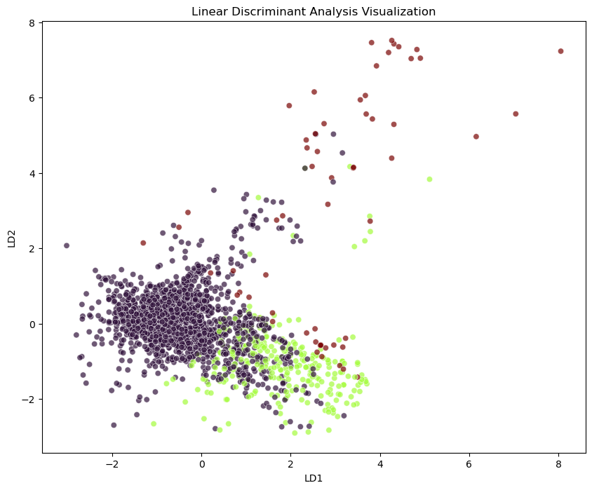

### Actionable Insights 
1. `histogram_median` and `histogram_mode` give nearly identical information, I can track only one of these metrics to save time and resources without sacrificing accuracy in fetal health assessments.

 2. The strong negative relationship between `histogram_mode` and `baseline_value` means that when one goes up and the other goes down, it could indicate important changes in fetal health. I could prioritize this pattern as an early warning system.

3. Some metrics like `fetal_movement` and `baseline_value` don’t influence each other much. This means they measure different aspects of fetal health, so a comprehensive monitoring system should track both for a full picture.

4.  The "histogram" metrics all provide similar insights, so I could reduce the number of metrics it tracks. This would make data collection quicker, reducing the workload for healthcare staff without losing important patient information.

## Model Building 
+ Features Selection
+ Data Train/Test/Split
+ Algorithm Comparisms
    - Logistic Regression
    - K-Nearest Neighbour
    - Decision Tree Classifier
    - Support Vector Machine
    - Linear Discriminant Analysis
+ Serialize (Save Model)

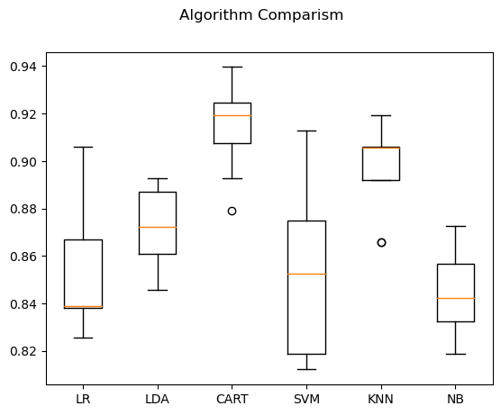
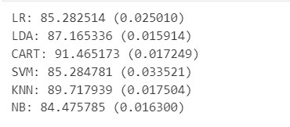

## Model Interpretation
I believe that Interpretable ML is key to Responsible AI 
 + I implemented explainable AI techniques using Decision Tree and model interpretation to understand the decisions made by the black-box machine learning model for individual patients. With this technique, healthcare professionals can gain insights into which features are most influential in predicting the patient's outcome (i.e., Normal, Suspected or Pathological). 
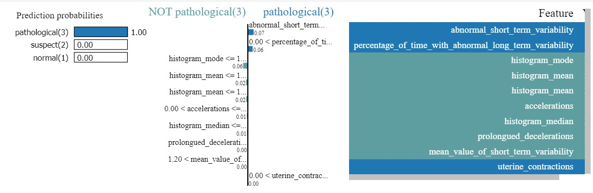
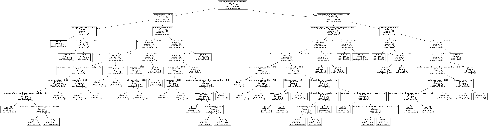

## Model Evaluation Metrics
Since this is a binary classification problem, I used the following metrics:
* **Confusion matrix** - For getting a better clarity of the number of correct/incorrect predictions made by the model.
* **Classification report** - For providing insights into the model's performance.
* **Accuracy score** - To evaluate the overall performance of the classification model.
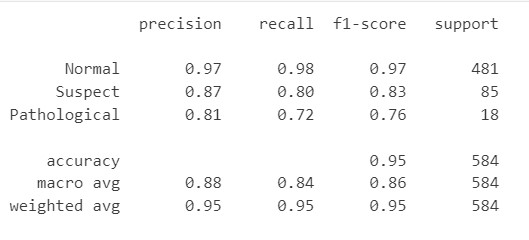

## Data-Driven Solution 
  ### Deploying the Model with a Flask Web Application 
 + To make the model accessible to both patients and doctors, I operationalized the system with a user-friendly Flask web application. The Flask web app provides a friendly user interface where users can input relevant parameters through a web form. Upon submission, the app processes the input data using the accurately trained cloud based fetal health machine learning model and provides the predicted outcome (Normal, Pathological or Suspected). A demo of the Flask web app is shown below;

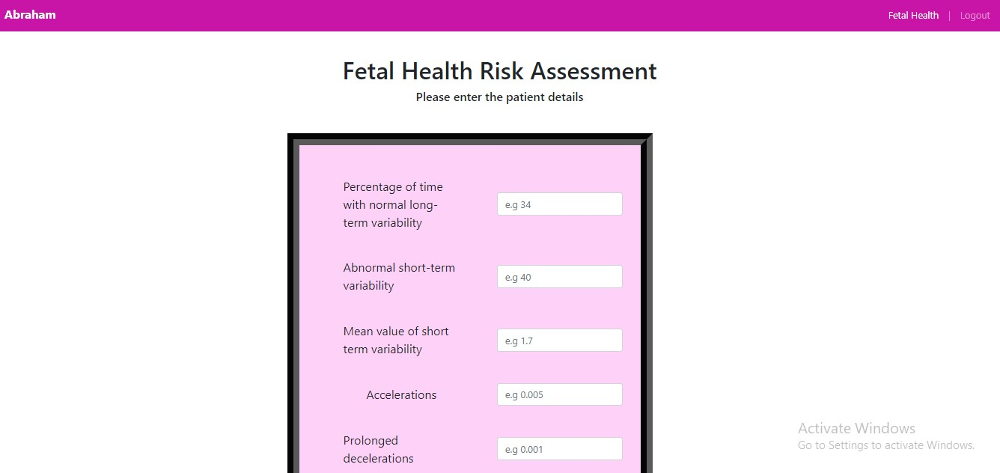
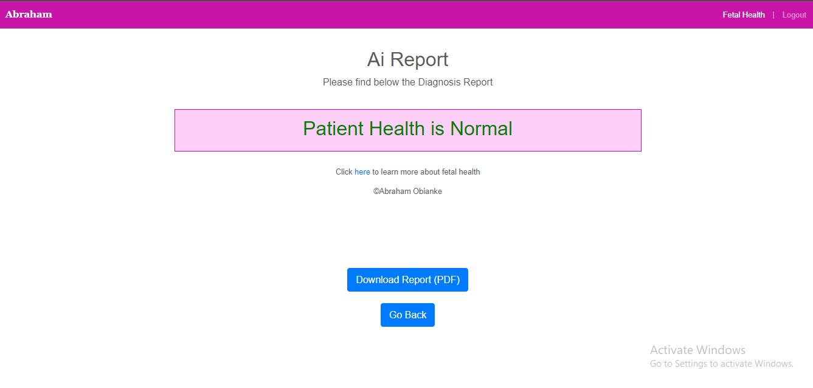

### Web App Status 
+ Not yet deployed due to cost issues

## Project Highlight(s)
+ ✅ Model achieved an accuracy of >90% using K-Nearest Neighbor machine learning algorithm
+ ✅ Model built on robust dataset classified & labelled by expert Obstetricians to ensure reliable and actionable prediction 
+ ✅ Model operationalized with a user friendly flask web application
  

## Model Monitoring and Maintenance 
- I leveraged a robust cloud ML platform and implemented a quality control check, experiment tracking, model maintenance and model monitoring techniques to observe data drift and prevent performance degradation. This is to help ensure model fairness, improve model performance and maintain model reliability.
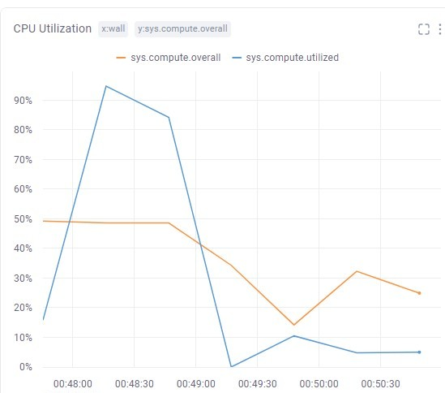

## Technologies Used
- Python 
- Coding Tools
   - VS Code
   - Lightning.ai
- ML Libraries 
  - Scikit-Learn
  - Pandas
  - Numpy
  - Matplotlib
  - Seaborn
  - Lime
  - Joblib
  - Comet ML
- Web App Frameworks 
  - Flask
  - Bootstrap 
  - HTML
  - CSS
  - JavaScript
    
 

## Data Source
The dataset was sourced from the University of California Irvine dataset archive consisting of over 2126 Cardiotogram (CTGs) measurements of fetal heart rate (FHR) and uterine contraction (UC) features classified by expert obstetricians.(https://archive.ics.uci.edu/dataset/193/cardiotocography).

## Conclusion
As an AI Engineer with a background in Medicine, I am deeply committed to the holistic well-being of mothers and their children. This project involving detecting fetal health risks reflects my dedication to working towards the 2030 United Nations Sustainable Development Goal 3 of ending all preventable deaths under five years of age using machine learning techniques and a Data-Driven approach.

## Contact
I'm Abraham Obianke. For any inquiries, feedback or collaborations feel free to [Connect with me on LinkedIn](https://www.linkedin.com/in/abraham-obianke-269112197?utm_source=share&utm_campaign=share_via&utm_content=profile&utm_medium=android_app) or send me an Email via  [abrahamoaks@gmail.com](mailto:your_email@example.com).

### References 
1. Healthline (https://www.healthline.com/health/pregnancy/risk-factors)
2. University of California Irvine dataset archive (https://archive.ics.uci.edu/dataset/193/cardiotocography)
2. The United Nations Children's Fund (UNICEF) (https://data.unicef.org/topic/child-survival/neonatal-mortality/)

